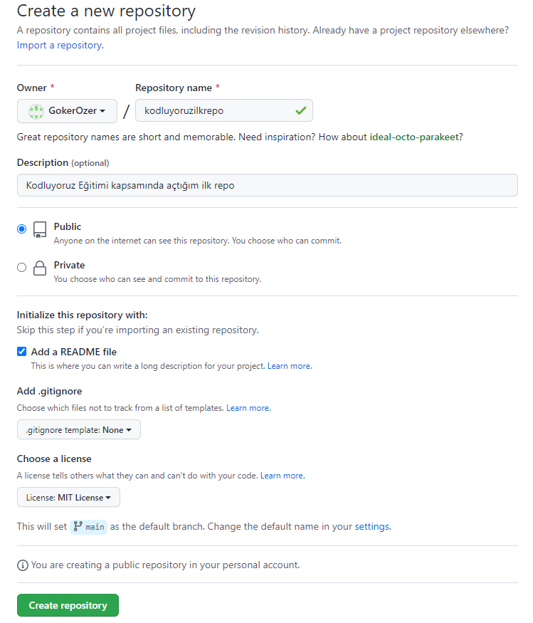

# Kodluyoruz İlk Repo


Bu repo [Kodluyoruz](https://www.kodluyoruz.org/) GIT eğitiminde oluşturduğumuz ilk repo. İçerisinde bir adet README dosyası ve bir adet index.html dosyası barındırıyor.



## Installation

Öncelikle projeyi **klonlayın**. (Buraya sizin reponuzdan aldığınız link gelecek.)
```
git clone https://github.com/GokerOzer/kodluyoruzilkrepo.git
```

## Usage

Projeyi klonladıktan sonra Visual Studio Code programını açınız.

Linux için:
```
cd kodluyoruzilkrepo
code .
```

## Contributing

Pull requestleri kabul edilir. Büyük değişiklikler için lütfen önce neyi değiştirmek istediğinizi tartışmak için bir konu açınız.

## License

[MIT](https://choosealicense.com/licenses/mit/)